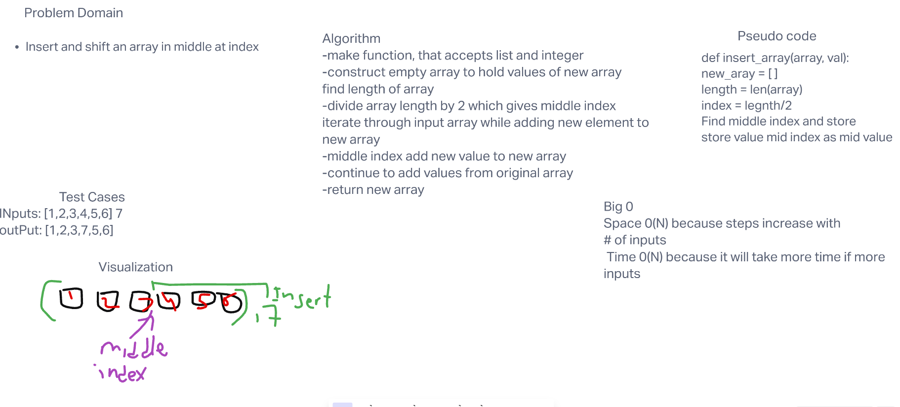

# Challenge 02 - Array-Insert-shift

# Insert to Middle of an Array
Insert and shift an array in middle at index

## Whiteboard Process

## Approach & Efficiency
divide array length by 2 which gives middle index
iterate through input array while adding new element to new array

Space 0(N) because steps increase with number of inputs

Time 0(N) because it will take more time if more inputs
