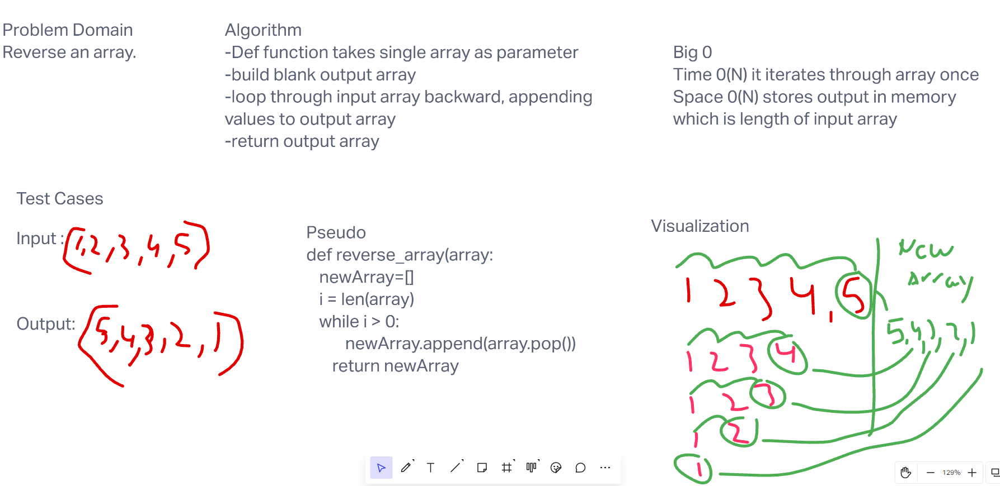

# Challenge 01 - Array Reverse
# Reverse an Array
Reverse input array

## Whiteboard Process

## Approach & Efficiency
Take input array make new array, loop throug array while removing last number to new array.
I used this approach because it seemed the most simple.
Time 0(N) it iterates through array once
Space 0(N) stores output in memory which is length of input array
