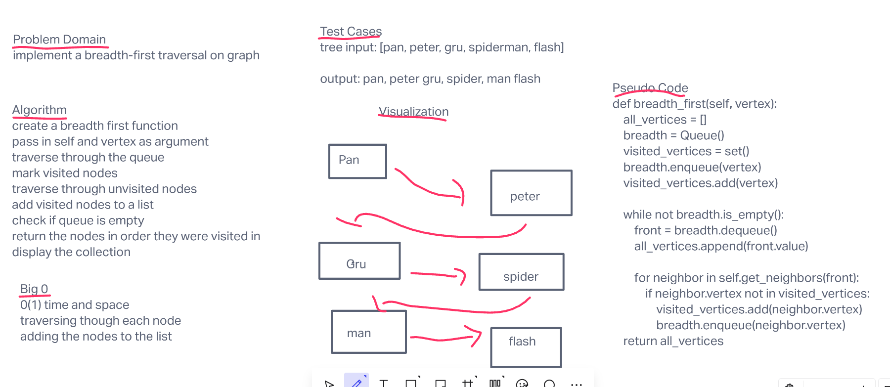

# Challnege Summary

## whiteboard Process

## solution

    def breadth_first(self, vertex):
        all_vertices = []
        breadth = Queue()
        visited_vertices = set()
        breadth.enqueue(vertex)
        visited_vertices.add(vertex)

        while not breadth.is_empty():
            front = breadth.dequeue()
            all_vertices.append(front.value)

            for neighbor in self.get_neighbors(front):
                if neighbor.vertex not in visited_vertices:
                    visited_vertices.add(neighbor.vertex)
                    breadth.enqueue(neighbor.vertex)
        return all_vertices

## Contributors:
- Jamal Malik
- Ryan McMillan
- Alec Torres
