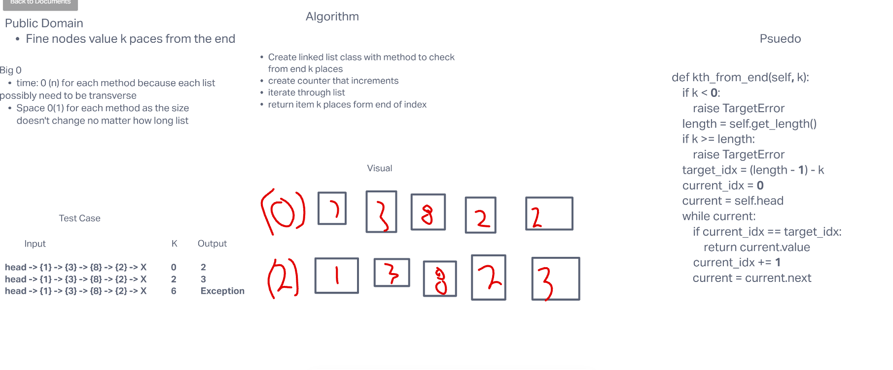

# Challenge 7 kth
## Riki E Plaza
# Challenge Summary

### Write the following method for the Linked List class:
-kth from end
- argument: a number, k, as a parameter.
- Return the node’s value that is k places from the tail of the linked list.
- You have access to the Node class and all the properties on the Linked List class as well as the methods created in previous challenges.

### White Board

### EFficiency
### Big 0

- time: 0 (n) for each method because each list
possibly need to be transverse

- Space 0(1) for each method as the size doesn't change no matter how long list

### Solution
def kth_from_end(self, k):

    if k < 0:

        raise TargetError

    length = self.get_length()

    if k >= length:

        raise TargetError

    target_idx = (length - 1) - k

    current_idx = 0

    current = self.head

    while current:

        if current_idx == target_idx:

            return current.value

        current_idx += 1

        current = current.next

