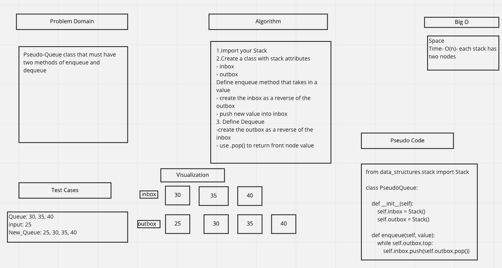

# Stack-queue-pseudo
- Implement a Queue using two Stacks

## WhiteBoard

## Solution

class PseudoQueue:

    def __init__(self):
        self.inbox = Stack()
        self.outbox = Stack()

    def enqueue(self, value):
        while self.outbox.top:
            self.inbox.push(self.outbox.pop())
        self.inbox.push(value)

    def dequeue(self):
        while self.inbox.top:
            self.outbox.push(self.inbox.pop())
        return self.outbox.pop()

## Contributors
- Jamal Malik
- Alec Torres
- Ryan McMillan
