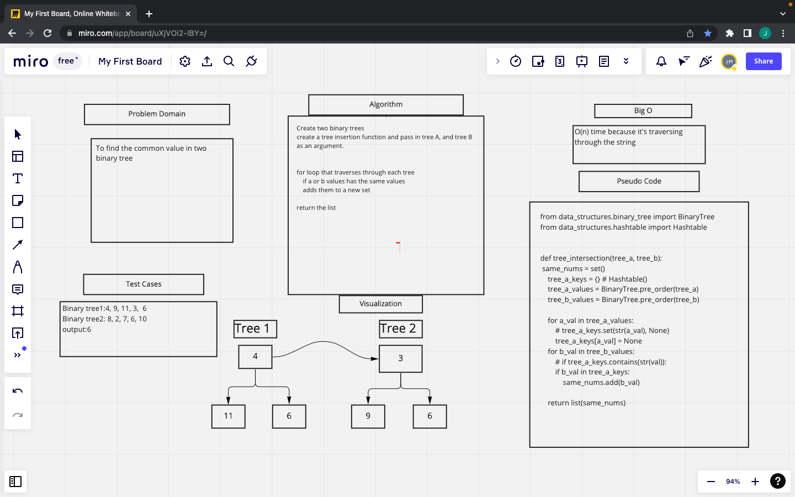

# Challenge Summary
- Write a function called tree_intersection that takes two binary trees as parameters.
- Using your Hashmap implementation as a part of your algorithm, return a set of values found in both trees.

## Whiteboard Process

## Solution
def tree_intersection(tree_a, tree_b):
    same_nums = set()
    tree_a_keys = {} # Hashtable()
    tree_a_values = BinaryTree.pre_order(tree_a)
    tree_b_values = BinaryTree.pre_order(tree_b)

    for a_val in tree_a_values:
        tree_a_keys[a_val] = None
    for b_val in tree_b_values:
        if b_val in tree_a_keys:
            same_nums.add(b_val)

    return list(same_nums)

### Collaborators:
- Jamal Malik
- Ryan McMillan
- Alec Torres
