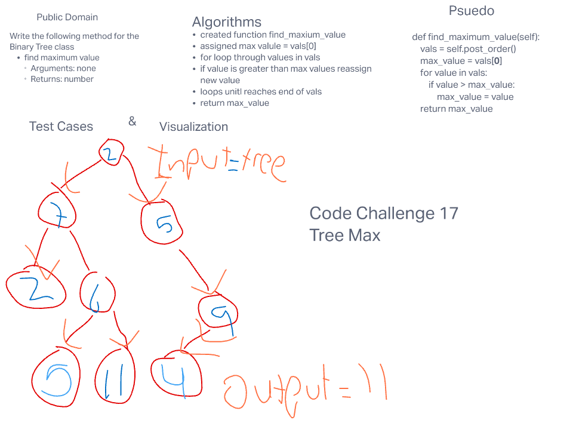

# Challenge Summary
- Write the following method for the Binary Tree class

- find maximum value
- Arguments: none
- Returns: number
- Find the maximum value stored in the tree. You can assume that the values stored in the Binary Tree will be numeric.

## Whitebaord Process

## Approach

## Solution
    def find_maximum_value(self):
        vals = self.post_order()
        max_value = vals[0]
        for value in vals:
            if value > max_value:
                max_value = value
        return max_value
